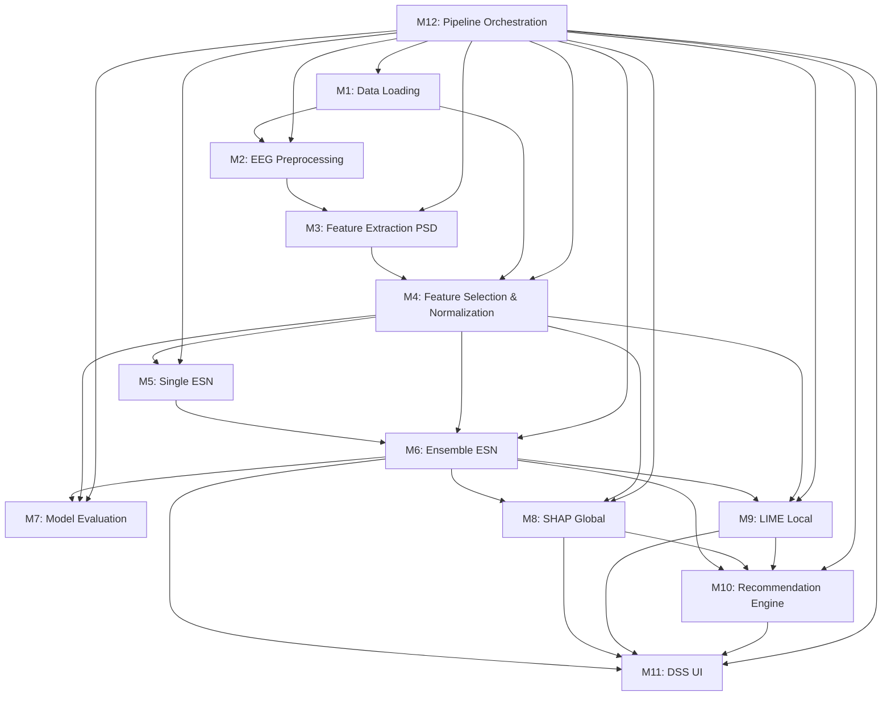

# 02 — MODULE ANALYSIS

> Decomposition chi tiết tất cả Module cần thiết để RE-IMPLEMENT project dựa trên paper.

---

## Module M1: EEG Data Loading & Validation

### Mục đích
Load raw EEG data từ file, validate format, và chuẩn bị cho preprocessing pipeline.

### Input
- Raw EEG files (format phụ thuộc dataset — paper dùng dataset từ Aminov et al. [2])
- Metadata: patient demographics (age, gender, education, stroke/control label)

### Output
- Structured EEG data object (numpy array hoặc MNE Raw object)
- Patient metadata dictionary

### Công việc chính
- Parse EEG file format (có thể là .csv, .edf, .mat tùy dataset gốc)
- Validate sampling rate, channel info
- Map patient metadata với EEG recordings
- Handle missing data

### Algorithm/model sử dụng
- Không có algorithm đặc biệt — chỉ I/O và data parsing

### Thông tin paper cung cấp
> **FACT FROM PAPER**: Dataset từ Aminov et al. (2017) [2] — "Acute single channel EEG predictors of cognitive function after stroke" — PLoS One. 24 participants. Single pre-frontal electrode. Recorded within 72h of stroke.

### Phần phải tự implement
- Tìm và download dataset gốc (paper nói "Data will be made available on request")
- Xác định file format thực tế
- Viết data loader tương ứng

### Dependency
- Không phụ thuộc module khác (module đầu tiên trong pipeline)

### Độ khó và rủi ro
- **Độ khó**: Thấp–Trung bình
- **Rủi ro CHÍNH**: Dataset có thể không public. Paper gốc [2] cũng nói "data available on request". Nếu không lấy được data → phải tìm dataset thay thế hoặc simulate.

---

## Module M2: EEG Preprocessing

### Mục đích
Loại bỏ noise, artifacts, và chuẩn bị EEG signal sạch cho feature extraction.

### Input
- Raw EEG data từ Module M1

### Output
- Artifact-free EEG epochs (4 giây mỗi epoch)

### Công việc chính
1. **Band-pass filtering**: 0.5–30 Hz để loại bỏ noise ngoài dải tần số mong muốn
2. **Artifact removal**: 
   - Manual inspection để xác định và đánh dấu data bị ô nhiễm bởi movement/muscle artifact
   - Loại bỏ epochs đã đánh dấu
3. **Amplitude thresholding**: Loại bỏ epochs có amplitude vượt ±100 μV
4. **Epoching**: Chia EEG signal liên tục thành các epochs 4 giây

### Algorithm/model sử dụng
> **FACT FROM PAPER**:
- Band-pass filter (0.5–30 Hz)
- Manual artifact inspection
- Amplitude threshold ±100 μV

> **INFERENCE/RECOMMENDATION**:
- Dùng MNE-Python cho filtering + epoching
- Butterworth bandpass filter hoặc FIR filter
- Có thể thay "manual inspection" bằng automated artifact rejection (ICA hoặc autoreject) để reproducible hơn

### Thông tin paper cung cấp
> **FACT FROM PAPER**: 
- Filter range: 0.5–30 Hz
- Epoch length: 4 seconds
- Amplitude threshold: ±100 μV
- Manual inspection cho artifacts

### Phần phải tự implement
- Quyết định dùng filter type nào (FIR/IIR/Butterworth)
- Automated artifact detection thay manual inspection
- Filter order, transition bandwidth
- Epoch overlap (paper không nói có overlap hay không)

### Dependency
- Module M1 (cần raw EEG data)

### Độ khó và rủi ro
- **Độ khó**: Trung bình
- **Rủi ro**: "Manual inspection" không reproducible. Kết quả preprocessing ảnh hưởng rất lớn đến downstream performance. Nếu preprocessing khác → features khác → accuracy khác.

---

## Module M3: Feature Extraction (Adapted PSD)

### Mục đích
Trích xuất frequency-domain features từ EEG epochs sạch.

### Input
- Artifact-free EEG epochs từ Module M2

### Output
- Feature vector cho mỗi participant/epoch:
  - RP Delta (Relative Power in Delta band)
  - RP Theta (Relative Power in Theta band)
  - RP Alpha (Relative Power in Alpha band)
  - RP Beta (Relative Power in Beta band)
  - DAR (Delta/Alpha Ratio)
  - DTR (Delta/Theta Ratio)

### Công việc chính
1. Apply FFT trên mỗi 4-second epoch (resolution 1/4 Hz = 0.25 Hz)
2. Tính Power Spectral Density (PSD)
3. Tính tổng power trong từng frequency band:
   - Delta: 0.5–4 Hz
   - Theta: 4–8 Hz
   - Alpha: 8–13 Hz
   - Beta: 13–30 Hz
4. Tính Relative Power (RP): power_band / total_power
5. Tính ratios: DAR = RP_Delta / RP_Alpha, DTR = RP_Delta / RP_Theta

### Algorithm/model sử dụng
> **FACT FROM PAPER**: 
- Fast Fourier Transform (FFT)
- Power Spectral Density analysis (Algorithm 1)
- Welch's method (reference [61] — Welch 1967)

> **INFERENCE/RECOMMENDATION**: 
- Dùng `scipy.signal.welch()` hoặc `mne.time_frequency.psd_array_welch()`
- Window length = 4 seconds → frequency resolution = 0.25 Hz khớp với paper

### Thông tin paper cung cấp
> **FACT FROM PAPER**:
- Epoch length: 4 seconds
- Resolution: 1/4 Hz (0.25 Hz)
- Features: RP Delta, RP Theta, RP Alpha, RP Beta, DAR, DTR
- Frequency bands: paper ngầm dùng standard EEG bands

### Phần phải tự implement
- Exact frequency band boundaries (paper nói "standard" nhưng có nhiều convention khác nhau)
- Window function cho FFT (Hamming? Hanning?)
- Có overlap segments trong Welch method không?
- Cách aggregate features: trung bình trên tất cả epochs hay dùng từng epoch riêng?

### Dependency
- Module M2 (cần clean EEG epochs)

### Độ khó và rủi ro
- **Độ khó**: Trung bình
- **Rủi ro**: Frequency band definitions khác nhau giữa references. Window function khác nhau → PSD estimates khác nhau.

---

## Module M4: Feature Selection & Normalization

### Mục đích
Chọn subset features tối ưu và normalize chúng.

### Input
- Full feature set từ Module M3 + categorical features (age, gender, education)

### Output
- Selected feature matrix (normalized [0, 1])
- Feature names list

### Công việc chính
1. Combine EEG features + categorical features thành feature matrix
2. Apply "filter-based feature importance algorithm" (Algorithm 1 trong paper)
3. Select top features
4. Normalize tất cả features về scale [0, 1]

### Algorithm/model sử dụng
> **FACT FROM PAPER**: 
- "Filter-based feature importance algorithm"
- "4 optimal features are extracted"
- Normalization to [0, 1]

> **INFERENCE/RECOMMENDATION**:
- Filter-based methods: mutual information, chi-squared, ANOVA F-test, correlation-based
- MinMaxScaler cho normalization về [0, 1]

### Thông tin paper cung cấp
> **FACT FROM PAPER**: 
- Chọn 4 optimal features
- Normalize [0, 1]

> **PAPER KHÔNG NÓI**:
- Filter metric cụ thể là gì
- 4 features nào được chọn (mâu thuẫn: SHAP analysis cho thấy 8 features → model dùng nhiều hơn 4?)
- Normalize trước hay sau feature selection?

### Chú ý QUAN TRỌNG — Mâu thuẫn trong paper
Paper nói "four optimal features are extracted" (Section 4.3.2) nhưng SHAP analysis (Section 4.5.1) liệt kê **8 features**: DTR, Theta, RP Delta, RP Alpha, age, beta, years of education, gender. Điều này nghĩa là:
- Hoặc paper dùng nhiều hơn 4 features
- Hoặc "4 optimal features" chỉ là EEG features, và categorical features (age, gender, education) được thêm riêng

> **INFERENCE**: Có vẻ paper dùng tất cả EEG features (RP Delta, RP Theta, RP Alpha, RP Beta, DTR + có thể DAR) cộng với categorical features → tổng ~8+ features.

### Dependency
- Module M3 (cần extracted features)
- Module M1 (cần categorical data)

### Độ khó và rủi ro
- **Độ khó**: Thấp–Trung bình
- **Rủi ro**: Mâu thuẫn trong paper về số lượng features thực sự được sử dụng.

---

## Module M5: ESN (Echo State Network) — Single Model

### Mục đích
Implement một ESN classifier đơn lẻ.

### Input
- Feature matrix (selected + normalized) từ Module M4
- Labels: Stroke (1) vs Control (0)

### Output
- Trained ESN model
- Predictions (probabilities + class labels)

### Công việc chính
1. Initialize reservoir: random weights W (spectral radius scaled), random Win
2. Run input through reservoir → collect reservoir states
3. Solve for Wout (linear regression hoặc ridge regression)
4. Classify: pass reservoir states through readout layer

### Algorithm/model sử dụng
> **FACT FROM PAPER**:
- State update: `x(t) = Σ wi * x(t-1) + u(t)` (Eq. 3 — simplified)
- Output: `y(t) = ϕ(x(t))` (Eq. 4)
- Hyperparameters: 200 neurons, spectral radius 0.95, sparsity 0, noise 0.001

> **INFERENCE/RECOMMENDATION**:
- Dùng `reservoirpy` library hoặc implement from scratch
- Activation function: tanh (standard cho ESN)
- Output: softmax hoặc sigmoid cho classification
- Solve Wout: ridge regression (Tikhonov regularization) — regularization parameter = noise = 0.001

### Thông tin paper cung cấp
> **FACT FROM PAPER** (Table 1):
- Neurons: 200
- Spectral radius: 0.95
- Sparsity: 0
- Noise: 0.001

### Phần phải tự implement
- Input scaling factor
- Leaking rate
- Warmup/washout period
- Output layer configuration cho classification (sigmoid? softmax?)
- Ridge regression vs pseudo-inverse cho Wout

### Dependency
- Module M4 (cần processed features)

### Độ khó và rủi ro
- **Độ khó**: Cao
- **Rủi ro cao**: ESN implementation details (leaking rate, input scaling, etc.) ảnh hưởng lớn đến performance. Paper không cung cấp đủ thông tin → phải tuning lại.

---

## Module M6: Ensemble ESN (E-ESN)

### Mục đích
Kết hợp 7 ESN thành ensemble model sử dụng bagging.

### Input
- Feature matrix + labels
- 7 initialized ESN models (từ Module M5 base)

### Output
- Trained E-ESN ensemble model
- Ensemble predictions
- Performance metrics

### Công việc chính
1. Tạo 7 ESN models với cùng hyperparameters nhưng random initializations khác nhau
2. Cho mỗi ESN:
   - Tạo bootstrap sample từ training data
   - Train ESN trên bootstrap sample
3. Aggregation: average predictions từ 7 ESN
4. Final prediction: class với average probability cao nhất

### Algorithm/model sử dụng
> **FACT FROM PAPER**: Bagging ensemble learning (Section 3.2)

> **INFERENCE/RECOMMENDATION**: 
- Có thể dùng sklearn BaggingClassifier wrapper nếu ESN implements sklearn interface
- Hoặc implement bagging thủ công cho flexibility

### Thông tin paper cung cấp
> **FACT FROM PAPER**:
- 7 ESNs
- Same hyperparameters, different random initializations
- Bagging with averaging
- Running time: 9.35 minutes

### Phần phải tự implement
- Bootstrap sample size (default sklearn: same size as training data)
- Random seed management cho reproducibility
- Voting strategy: soft voting (average probabilities) vs hard voting (majority class)

### Dependency
- Module M5 (cần base ESN implementation)
- Module M4 (cần processed features)

### Độ khó và rủi ro
- **Độ khó**: Trung bình (sau khi M5 hoàn thành)
- **Rủi ro**: Variance cao do sample nhỏ. Bootstrap trên 24 mẫu → mỗi bootstrap chỉ có ~15-16 unique samples.

---

## Module M7: Model Evaluation

### Mục đích
Đánh giá hiệu năng E-ESN model với các metrics chuẩn.

### Input
- Trained E-ESN model
- Test data (features + true labels)

### Output
- Confusion matrix
- Performance metrics: Accuracy, PPV, NPV, Sensitivity, Specificity, F1-score

### Công việc chính
1. Run predictions trên test set
2. Compute confusion matrix (TP, TN, FP, FN)
3. Calculate all metrics
4. Visualize confusion matrix
5. Compare với paper's reported metrics

### Algorithm/model sử dụng
- Standard classification metrics
- scikit-learn: `confusion_matrix`, `classification_report`

### Thông tin paper cung cấp
> **FACT FROM PAPER** (Table 2): Target metrics
- Accuracy: 96.50%
- PPV: 93.10%
- NPV: 90%
- Sensitivity: 96.42%
- Specificity: 81.81%
- F1-score: 94.73%

### Phần phải tự implement
- Train/test splitting strategy (paper không nói rõ)
- Cross-validation setup (nếu áp dụng)
- Statistical significance testing

### Dependency
- Module M6 (cần trained E-ESN)
- Module M4 (cần test data)

### Độ khó và rủi ro
- **Độ khó**: Thấp
- **Rủi ro**: Không biết train/test split → metric values sẽ khác paper.

---

## Module M8: SHAP Global Explanation

### Mục đích
Cung cấp global model explanation — hiểu overall behavior của E-ESN model.

### Input
- Trained E-ESN model (predict function)
- Feature matrix (training data hoặc full dataset)

### Output
- SHAP values cho mỗi feature
- Mean absolute SHAP values (feature importance ranking)
- SHAP summary plot
- SHAP bar plot

### Công việc chính
1. Initialize SHAP explainer (KernelSHAP vì ESN không phải tree-based)
2. Compute SHAP values cho tất cả instances
3. Generate summary plot (dot plot with feature value coloring)
4. Generate bar plot (average impact)
5. Rank features theo importance

### Algorithm/model sử dụng
> **FACT FROM PAPER**: SHAP (SHapley Additive exPlanations)

> **INFERENCE/RECOMMENDATION**:
- `shap.KernelExplainer` — model-agnostic, phù hợp cho ESN
- Background data: training set hoặc summary
- shap library (`pip install shap`)

### Thông tin paper cung cấp
> **FACT FROM PAPER**:
- Top 8 features: DTR, Theta, RP Delta, RP Alpha, age, beta, years of education, gender
- SHAP plots cho each class (Fig. 6a) và average impact (Fig. 6b)

### Phần phải tự implement
- SHAP explainer type selection
- Background dataset size
- Number of samples for KernelSHAP estimation
- Visualization styling to match paper

### Dependency
- Module M6 (cần trained E-ESN model)
- Module M4 (cần feature data)

### Độ khó và rủi ro
- **Độ khó**: Trung bình
- **Rủi ro**: KernelSHAP chậm trên nhiều features. Nhưng chỉ ~8 features → acceptable.

---

## Module M9: LIME Local Explanation

### Mục đích
Cung cấp local model explanation — giải thích từng prediction riêng lẻ.

### Input
- Trained E-ESN model (predict function)
- Single instance cần giải thích
- Training data (cho reference distribution)

### Output
- LIME explanation object cho instance
- Feature importance bars
- Feature value contributions
- Prediction probabilities per class

### Công việc chính
1. Initialize LIME TabularExplainer
2. Cho mỗi instance cần giải thích:
   - Generate perturbations around instance
   - Get E-ESN predictions cho perturbations
   - Fit local surrogate model (linear)
   - Extract feature weights
3. Visualize as bar chart + text

### Algorithm/model sử dụng
> **FACT FROM PAPER**: LIME (Local Interpretable Model-Agnostic Explanations)

> **INFERENCE/RECOMMENDATION**:
- `lime.lime_tabular.LimeTabularExplainer`
- lime library (`pip install lime`)

### Thông tin paper cung cấp
> **FACT FROM PAPER** (Fig. 7):
- 2 examples: 1 Control + 1 Stroke
- Shows prediction probabilities + feature contributions

### Phần phải tự implement
- Number of perturbation samples
- Number of features to show in explanation
- Feature discretization strategy
- Integration with DSS UI

### Dependency
- Module M6 (cần trained E-ESN model)
- Module M4 (cần feature data)

### Độ khó và rủi ro
- **Độ khó**: Thấp–Trung bình
- **Rủi ro**: LIME explanations có thể inconsistent giữa các runs (randomness trong perturbation).

---

## Module M10: Recommendation Engine

### Mục đích
Sinh ra diagnostic recommendations dựa trên prediction results.

### Input
- E-ESN prediction (stroke probability + class)
- Feature importance (từ SHAP/LIME)
- Patient demographics

### Output
- List of recommended diagnostic tests
- Priority ranking
- Reasoning for each recommendation

### Công việc chính
1. Map prediction outcome → relevant diagnostic tests
2. Prioritize tests based on stroke probability level
3. Generate human-readable recommendation text

### Algorithm/model sử dụng
> **FACT FROM PAPER**: Recommends MRI, CBC, BMP, Coagulation Profile, Lipid Profile, D-Dimer

> **INFERENCE/RECOMMENDATION**: Đây hầu như chắc chắn là rule-based system:
```
if stroke_probability > threshold:
    recommend [MRI, CBC, BMP, Coagulation, Lipid, D-Dimer]
else:
    recommend routine follow-up
```

### Thông tin paper cung cấp
> **FACT FROM PAPER**: Chỉ liệt kê 6 loại tests. Không có logic chi tiết.

### Phần phải tự implement (HOÀN TOÀN)
- Logic rule engine
- Probability thresholds
- Test priority ranking
- Reasoning text generation
- Nên tham khảo clinical guidelines cho stroke diagnostic workup

### Dependency
- Module M6 (predictions)
- Module M8, M9 (explanations — optional cho reasoning)

### Độ khó và rủi ro
- **Độ khó**: Trung bình
- **Rủi ro**: Không có clinical validation. Cần consult domain expert hoặc guidelines.

---

## Module M11: DSS User Interface

### Mục đích
Giao diện web cho physician tương tác với hệ thống.

### Input
- Tất cả output từ modules trước: patient data, predictions, explanations, recommendations

### Output
- Web interface với các thành phần:
  - Patient information panel
  - EEG data display
  - Prediction result (probability + class)
  - SHAP button / LIME button
  - Recommendation panel
  - Confirm / Cancel actions

### Công việc chính
1. Design UI layout (theo paper's Fig. 8)
2. Build frontend components
3. Connect với backend (prediction service)
4. Implement SHAP/LIME visualization panels
5. Implement recommendation display + interaction

### Algorithm/model sử dụng
- Không có ML algorithm — pure software engineering

> **INFERENCE/RECOMMENDATION**:
- Frontend: React hoặc Streamlit (cho prototype) hoặc Flask + HTML/CSS/JS
- Backend: Flask/FastAPI serving E-ESN model
- Visualization: Plotly, matplotlib (for SHAP/LIME plots)

### Thông tin paper cung cấp
> **FACT FROM PAPER** (Fig. 8): UI mockup/screenshot showing layout sections

### Phần phải tự implement (HOÀN TOÀN)
- Toàn bộ UI/UX
- API design
- Data flow
- Session management
- Error handling

### Dependency
- Module M6 (model)
- Module M8 (SHAP)
- Module M9 (LIME)
- Module M10 (recommendations)

### Độ khó và rủi ro
- **Độ khó**: Trung bình–Cao (nhiều components)
- **Rủi ro**: Scope creep. Nên bắt đầu với Streamlit prototype trước.

---

## Module M12: Pipeline Orchestration & Configuration

### Mục đích
Quản lý toàn bộ pipeline execution, configuration, và reproducibility.

### Input
- Configuration file (hyperparameters, paths, settings)
- Raw data path

### Output
- Complete pipeline execution
- Results + logs
- Saved models

### Công việc chính
1. Config management (YAML/JSON)
2. Pipeline orchestration (run modules in order)
3. Logging and experiment tracking
4. Model serialization (save/load)
5. Random seed management
6. Results reporting

### Algorithm/model sử dụng
- Không có ML — infrastructure/tooling

> **INFERENCE/RECOMMENDATION**:
- Config: Hydra hoặc simple YAML
- Experiment tracking: MLflow, Weights & Biases, hoặc simple logging
- Model saving: pickle, joblib

### Phần phải tự implement
- Hoàn toàn tự implement

### Dependency
- Tất cả modules khác

### Độ khó và rủi ro
- **Độ khó**: Trung bình
- **Rủi ro**: Thấp — infrastructure work

---

## DEPENDENCY DIAGRAM



---

## ĐỘ KHÓ TỔNG HỢP

- **Thấp**: M1 (Data Loading), M7 (Evaluation)
- **Trung bình**: M2 (Preprocessing), M3 (Feature Extraction), M4 (Feature Selection), M6 (Ensemble), M8 (SHAP), M9 (LIME), M10 (Recommendation), M12 (Pipeline)
- **Cao**: M5 (ESN Implementation), M11 (DSS UI)

---

## CRITICAL PATH

```
M1 → M2 → M3 → M4 → M5 → M6 → M7 (evaluation gate)
                                  ↘
                              M8, M9 (parallel)
                                  ↘
                              M10 → M11
```

**Bottleneck modules**: M1 (dataset availability), M5 (ESN implementation correctness)
